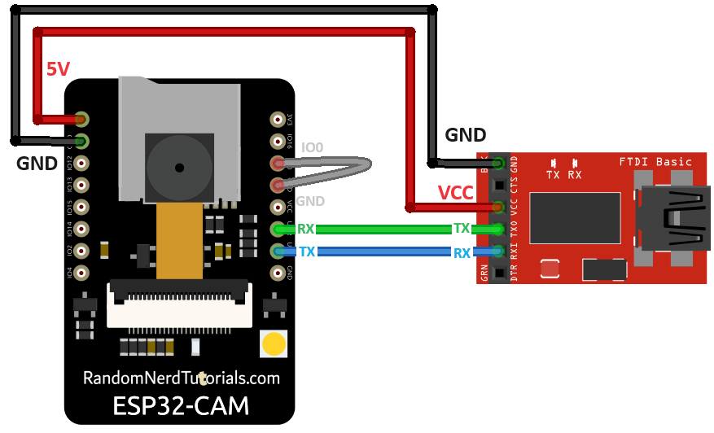

# Camera live server

## Flashing

- GPIO 0 must be connected to GND to upload a sketch
- After connecting GPIO 0 to GND, press the ESP32-CAM on-board RESET button to put your board in flashing mode

## Wiring

## Toolchain

Used ArduinoIDEv2